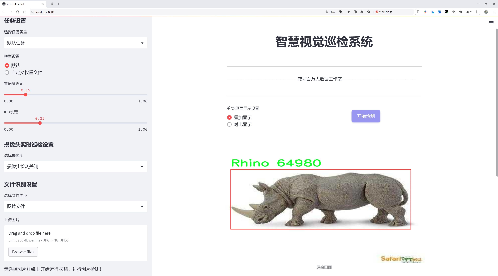
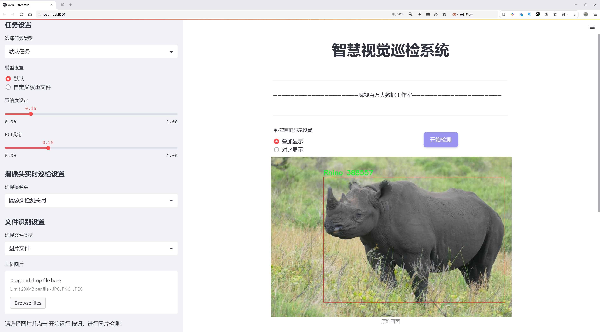
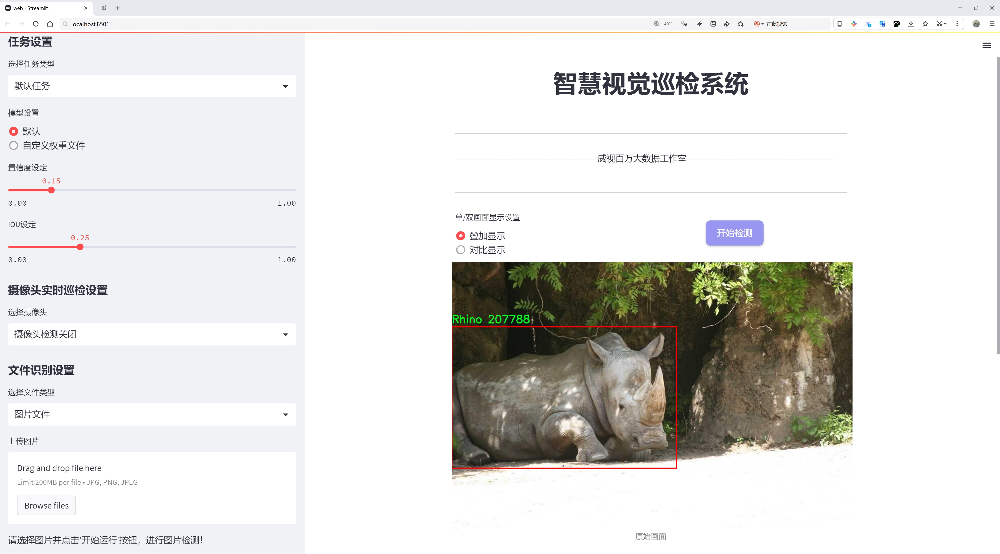
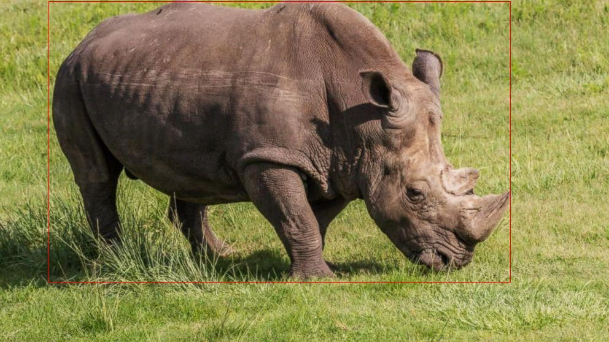
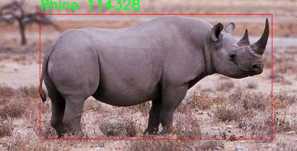
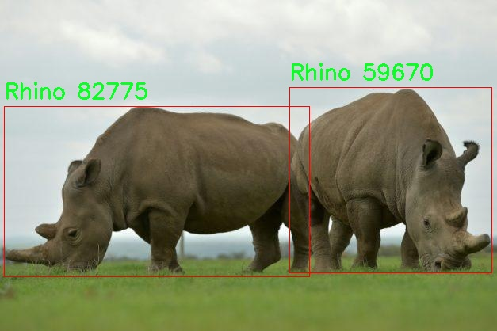
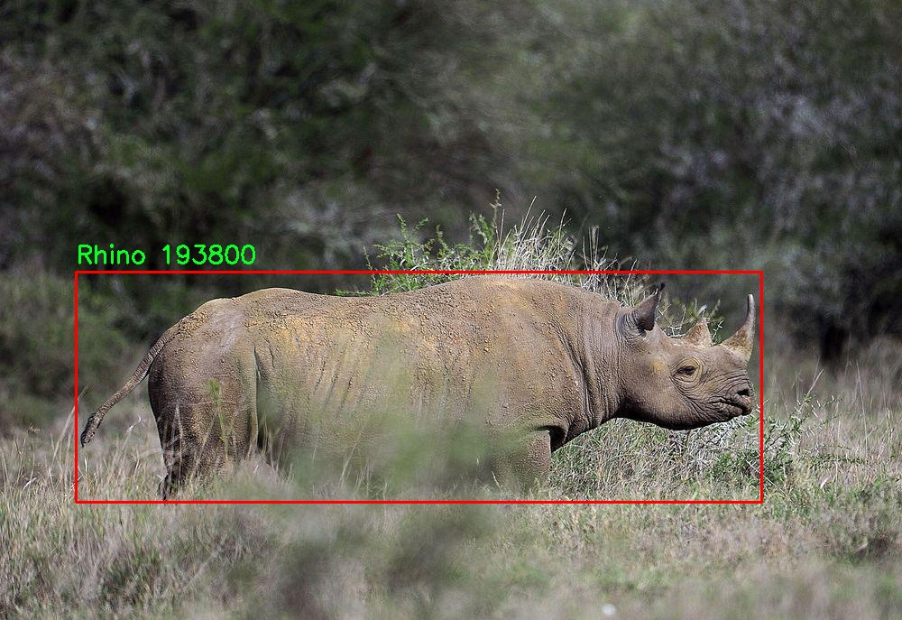
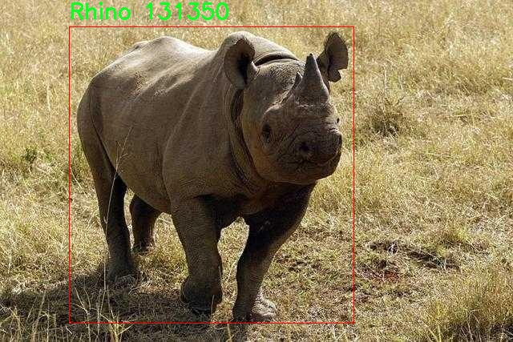

# 犀牛检测检测系统源码分享
 # [一条龙教学YOLOV8标注好的数据集一键训练_70+全套改进创新点发刊_Web前端展示]

### 1.研究背景与意义

项目参考[AAAI Association for the Advancement of Artificial Intelligence](https://gitee.com/qunmasj/projects)

项目来源[AACV Association for the Advancement of Computer Vision](https://kdocs.cn/l/cszuIiCKVNis)

研究背景与意义

随着全球生态环境的变化和人类活动的加剧，野生动物的生存面临着前所未有的威胁。犀牛作为一种濒危物种，其数量在过去几十年中急剧减少，主要原因包括栖息地的破坏和非法猎杀。根据国际自然保护联盟（IUCN）的报告，犀牛的栖息地丧失和偷猎现象已经导致其在多个地区的灭绝风险显著增加。因此，保护犀牛及其栖息环境已成为全球生态保护的重要任务之一。为了有效地监测和保护犀牛种群，科学家们逐渐将计算机视觉和深度学习技术应用于野生动物监测中，以期提高监测的效率和准确性。

在众多的计算机视觉技术中，YOLO（You Only Look Once）系列模型因其实时性和高精度而受到广泛关注。YOLOv8作为该系列的最新版本，进一步提升了目标检测的性能，特别是在复杂环境下的检测能力。然而，针对特定物种的检测系统仍然面临着许多挑战，例如数据集的多样性、模型的泛化能力以及在实际应用中的稳定性。因此，基于改进YOLOv8的犀牛检测系统的研究具有重要的理论和实践意义。

本研究的基础数据集包含2400张犀牛图像，涵盖了不同的环境和光照条件。这一数据集的构建为训练和评估目标检测模型提供了丰富的样本，有助于提升模型对犀牛的识别能力。通过对YOLOv8模型的改进，我们将针对犀牛的特征进行特定的优化，以提高其在各种复杂场景下的检测准确率。同时，研究还将探讨如何通过数据增强、迁移学习等技术，进一步提升模型的泛化能力，使其能够适应不同地区和环境下的犀牛监测需求。

此外，犀牛检测系统的成功应用不仅有助于科学家们实时监测犀牛的活动和栖息地变化，还能够为保护工作提供数据支持，帮助制定更为有效的保护策略。通过实时监测和数据分析，保护组织可以及时采取措施，减少偷猎行为，保护犀牛的生存环境，从而为犀牛种群的恢复和繁衍创造良好的条件。

综上所述，基于改进YOLOv8的犀牛检测系统的研究，不仅具有重要的学术价值，还对实际的生态保护工作具有深远的影响。通过提升目标检测技术在野生动物保护中的应用效果，我们期望能够为犀牛的保护提供更为科学和有效的解决方案，为全球生物多样性的保护贡献一份力量。

### 2.图片演示







##### 注意：由于此博客编辑较早，上面“2.图片演示”和“3.视频演示”展示的系统图片或者视频可能为老版本，新版本在老版本的基础上升级如下：（实际效果以升级的新版本为准）

  （1）适配了YOLOV8的“目标检测”模型和“实例分割”模型，通过加载相应的权重（.pt）文件即可自适应加载模型。

  （2）支持“图片识别”、“视频识别”、“摄像头实时识别”三种识别模式。

  （3）支持“图片识别”、“视频识别”、“摄像头实时识别”三种识别结果保存导出，解决手动导出（容易卡顿出现爆内存）存在的问题，识别完自动保存结果并导出到tempDir中。

  （4）支持Web前端系统中的标题、背景图等自定义修改，后面提供修改教程。

  另外本项目提供训练的数据集和训练教程,暂不提供权重文件（best.pt）,需要您按照教程进行训练后实现图片演示和Web前端界面演示的效果。

### 3.视频演示

[3.1 视频演示](https://www.bilibili.com/video/BV1Ceshe7E1Z/)

### 4.数据集信息展示

##### 4.1 本项目数据集详细数据（类别数＆类别名）

nc: 1
names: ['Rhino']


##### 4.2 本项目数据集信息介绍

数据集信息展示

在本研究中，我们采用了名为“rhino”的数据集，以支持对犀牛检测系统的改进，特别是针对YOLOv8模型的训练与优化。该数据集专注于单一类别的物种——犀牛，具有高度的针对性和专业性。数据集的类别数量为1，具体类别名称为“Rhino”。这种简化的类别设置使得模型能够集中学习与犀牛相关的特征，从而提高检测的准确性和效率。

“rhino”数据集的构建过程遵循了严格的标准，确保数据的质量和多样性。数据集中的图像涵盖了犀牛在不同环境和光照条件下的多种姿态和角度。这种多样性对于训练深度学习模型至关重要，因为它能够帮助模型学习到更为丰富的特征，从而在实际应用中具备更强的泛化能力。数据集中包含的图像来源于多个地点，包括自然保护区、野生动物园以及其他犀牛栖息地，确保了数据的代表性。

在数据标注方面，所有图像均经过专业人员的仔细标注，确保每一张图像中的犀牛都被准确框定。这种精确的标注不仅提高了数据集的质量，也为后续的模型训练提供了可靠的基础。由于犀牛的外形特征相对独特，模型在训练过程中能够快速识别出犀牛的轮廓和特征点，这对于提升检测精度至关重要。

为了进一步增强模型的鲁棒性，数据集还包含了一些经过数据增强处理的图像。这些增强手段包括旋转、缩放、裁剪和颜色调整等，旨在模拟不同的拍摄条件和环境变化。通过这种方式，模型在面对真实世界中的复杂场景时，能够更好地适应和应对各种挑战。

在训练过程中，我们将“rhino”数据集与YOLOv8模型相结合，利用其强大的特征提取能力和实时检测性能，旨在实现高效的犀牛检测。YOLOv8作为一种先进的目标检测算法，具备较高的检测速度和准确性，适合在需要实时监控的场景中应用。通过对“rhino”数据集的深入学习，模型将能够在各种环境中快速识别犀牛，并提供准确的位置信息。

此外，数据集的设计还考虑到了实际应用中的可扩展性。虽然当前版本的“rhino”数据集仅包含犀牛这一类别，但未来可以根据需要扩展到其他相关物种的检测。这种灵活性为研究人员提供了更多的可能性，使得该数据集不仅限于犀牛的检测，也可以用于更广泛的野生动物保护和监测研究。

综上所述，“rhino”数据集为改进YOLOv8的犀牛检测系统提供了坚实的基础。通过高质量的图像、多样化的场景和精准的标注，数据集不仅增强了模型的学习能力，也为未来的研究提供了广阔的空间。随着技术的不断进步，我们期待这一数据集能够在保护犀牛及其栖息环境方面发挥重要作用。











### 5.全套项目环境部署视频教程（零基础手把手教学）

[5.1 环境部署教程链接（零基础手把手教学）](https://www.ixigua.com/7404473917358506534?logTag=c807d0cbc21c0ef59de5)


[5.2 安装Python虚拟环境创建和依赖库安装视频教程链接（零基础手把手教学）](https://www.ixigua.com/7404474678003106304?logTag=1f1041108cd1f708b01a)

### 6.手把手YOLOV8训练视频教程（零基础小白有手就能学会）

[6.1 手把手YOLOV8训练视频教程（零基础小白有手就能学会）](https://www.ixigua.com/7404477157818401292?logTag=d31a2dfd1983c9668658)

### 7.70+种全套YOLOV8创新点代码加载调参视频教程（一键加载写好的改进模型的配置文件）

[7.1 70+种全套YOLOV8创新点代码加载调参视频教程（一键加载写好的改进模型的配置文件）](https://www.ixigua.com/7404478314661806627?logTag=29066f8288e3f4eea3a4)

### 8.70+种全套YOLOV8创新点原理讲解（非科班也可以轻松写刊发刊，V10版本正在科研待更新）

由于篇幅限制，每个创新点的具体原理讲解就不一一展开，具体见下列网址中的创新点对应子项目的技术原理博客网址【Blog】：


[8.1 70+种全套YOLOV8创新点原理讲解链接](https://gitee.com/qunmasj/good)

### 9.系统功能展示（检测对象为举例，实际内容以本项目数据集为准）

图9.1.系统支持检测结果表格显示

  图9.2.系统支持置信度和IOU阈值手动调节

  图9.3.系统支持自定义加载权重文件best.pt(需要你通过步骤5中训练获得)

  图9.4.系统支持摄像头实时识别

  图9.5.系统支持图片识别

  图9.6.系统支持视频识别

  图9.7.系统支持识别结果文件自动保存

  图9.8.系统支持Excel导出检测结果数据


### 10.原始YOLOV8算法原理

原始YOLOv8算法原理

YOLOv8作为YOLO系列中的最新版本，代表了目标检测领域的一次重要技术革新。其核心思想是将目标检测任务视为一个回归问题，通过一个单一的神经网络模型同时预测目标的位置和类别。这一创新的框架使得YOLO系列自诞生以来便在实时目标检测中占据了重要地位，而YOLOv8则在此基础上进行了多项关键性的改进，进一步提升了模型的性能和适用性。

首先，YOLOv8的网络结构可以分为三个主要部分：主干网络（backbone）、特征增强网络（neck）和检测头（head）。在主干网络中，YOLOv8继续采用了CSP（跨阶段局部网络）的设计理念，这种结构通过引入更多的跳层连接，增强了特征的表达能力，促进了信息的流动和梯度的传播，从而提高了模型的训练效率和检测精度。CSP的使用使得YOLOv8能够更好地捕捉图像中的细节特征，尤其是在处理复杂场景和小目标时，表现得尤为突出。

特征增强网络部分，YOLOv8引入了PAN-FPN（路径聚合网络-特征金字塔网络）的思想。这一设计旨在通过不同层次的特征融合，提升模型对多尺度目标的检测能力。PAN-FPN通过对特征图进行有效的上下文信息整合，使得模型能够在不同尺度下均衡地关注目标，从而实现更为精确的定位和分类。这一策略的实施，显著增强了YOLOv8在各种环境下的适应性，尤其是在目标尺寸变化较大的情况下，依然能够保持高效的检测性能。

在检测头部分，YOLOv8采用了全新的解耦头设计，取代了以往的耦合头。这一创新的关键在于将分类和回归任务分为两个独立的分支，使得每个任务可以更加专注于自身的目标。这种解耦设计不仅提高了模型的准确性，还有效解决了复杂场景下定位不准和分类错误的问题。通过将目标检测的不同任务分开处理，YOLOv8能够更好地应对多样化的检测需求，尤其是在处理重叠目标或复杂背景时，展现出更强的鲁棒性。

此外，YOLOv8引入了Anchor-free目标检测方法，这一方法的核心在于直接预测目标的位置和大小，而不再依赖于预先定义的锚点框。这一变革性设计简化了模型的训练过程，避免了传统方法中锚点框选择和调整的繁琐步骤。Anchor-free方法使得YOLOv8能够更快速地聚焦于目标位置的邻近点，从而使得预测框更接近于实际的边界框区域。这一创新不仅提升了检测速度，也提高了模型在不同尺度和形状目标上的适应能力。

YOLOv8的另一个显著优势在于其轻量化的模型权重，使得该算法能够在各种嵌入式设备上高效运行。这一特性使得YOLOv8不仅适用于高性能的GPU服务器，也能够在资源受限的环境中实现实时检测，满足了现代计算机视觉应用日益增长的需求。无论是在工业自动化、智能监控，还是在无人驾驶等领域，YOLOv8都展现出了广泛的应用潜力。

值得一提的是，YOLOv8在损失函数的设计上也进行了创新，采用了更加复杂和高效的损失计算方式。这一改进使得模型在训练过程中能够更好地平衡分类和定位的精度，进一步提升了整体的检测性能。通过对损失函数的优化，YOLOv8能够在多种数据集上实现更高的mAP（平均精度均值），为目标检测任务提供了更为可靠的解决方案。

综上所述，YOLOv8作为YOLO系列的最新进展，凭借其创新的网络结构、解耦设计、Anchor-free方法以及轻量化特性，标志着目标检测技术的又一次飞跃。它不仅继承了前辈模型的优点，还在多个方面进行了突破性改进，充分满足了实时检测的需求，展现出强大的应用前景。随着YOLOv8的推广和应用，目标检测领域必将迎来新的发展机遇，为各行各业的智能化进程提供有力支持。


### 11.项目核心源码讲解（再也不用担心看不懂代码逻辑）

#### 11.1 70+种YOLOv8算法改进源码大全和调试加载训练教程（非必要）\ultralytics\utils\__init__.py

以下是对代码中最核心部分的提取和详细中文注释：

```python
import os
import platform
import logging.config
from pathlib import Path
import torch
import yaml

# 设置一些常量
FILE = Path(__file__).resolve()  # 当前文件的绝对路径
ROOT = FILE.parents[1]  # 项目的根目录
DEFAULT_CFG_PATH = ROOT / 'cfg/default.yaml'  # 默认配置文件路径

# 设置日志记录
LOGGING_NAME = 'ultralytics'  # 日志名称
def set_logging(name=LOGGING_NAME, verbose=True):
    """设置日志记录配置"""
    level = logging.INFO if verbose else logging.ERROR  # 根据verbose设置日志级别
    logging.config.dictConfig({
        'version': 1,
        'disable_existing_loggers': False,
        'formatters': {
            name: {
                'format': '%(message)s'}},
        'handlers': {
            name: {
                'class': 'logging.StreamHandler',
                'formatter': name,
                'level': level}},
        'loggers': {
            name: {
                'level': level,
                'handlers': [name],
                'propagate': False}}})

# 加载默认配置
DEFAULT_CFG_DICT = yaml.safe_load(open(DEFAULT_CFG_PATH))  # 从YAML文件加载默认配置
DEFAULT_CFG = SimpleNamespace(**DEFAULT_CFG_DICT)  # 将配置转换为简单命名空间

# 检查是否在Docker容器中运行
def is_docker() -> bool:
    """检查当前脚本是否在Docker容器中运行"""
    file = Path('/proc/self/cgroup')
    return file.exists() and 'docker' in open(file).read()

# 检查网络连接
def is_online() -> bool:
    """检查是否有网络连接"""
    import socket
    for host in ['1.1.1.1', '8.8.8.8']:  # Cloudflare和Google的DNS
        try:
            socket.create_connection((host, 53), timeout=2).close()
            return True
        except OSError:
            continue
    return False

# 设置全局变量
ONLINE = is_online()  # 检查网络连接状态
USER_CONFIG_DIR = Path(os.getenv('YOLO_CONFIG_DIR') or get_user_config_dir())  # 用户配置目录

# 设置日志
set_logging()  # 初始化日志记录
LOGGER = logging.getLogger(LOGGING_NAME)  # 获取日志记录器
```

### 代码注释说明：
1. **常量设置**：
   - `FILE` 和 `ROOT` 用于获取当前文件和项目根目录的路径。
   - `DEFAULT_CFG_PATH` 指向默认配置文件的位置。

2. **日志记录配置**：
   - `set_logging` 函数用于设置日志记录的格式和级别，便于调试和信息输出。

3. **配置加载**：
   - 从 YAML 文件中加载默认配置，并将其转换为简单命名空间，以便于后续访问。

4. **环境检查**：
   - `is_docker` 函数用于检查当前脚本是否在 Docker 容器中运行，确保代码的可移植性。
   - `is_online` 函数用于检查网络连接状态，确保程序可以访问外部资源。

5. **全局变量设置**：
   - `ONLINE` 变量用于存储网络连接状态。
   - `USER_CONFIG_DIR` 用于获取用户配置目录，支持通过环境变量设置。

6. **日志记录器**：
   - 初始化日志记录器，以便在程序运行时输出日志信息，便于调试和监控。 

以上是对代码中核心部分的提取和详细注释，帮助理解代码的结构和功能。

这个文件是Ultralytics YOLOv8项目的一个核心模块，主要负责工具函数和配置的初始化。首先，文件引入了多个标准库和第三方库，如`os`、`logging`、`torch`等，这些库为后续的功能提供了支持。

文件开头定义了一些常量，包括多GPU训练的相关常量、文件路径、线程数、自动安装和详细模式的设置等。`DEFAULT_CFG_PATH`指向默认的配置文件路径，`ROOT`和`ASSETS`分别指向项目的根目录和默认的图像资源目录。

接下来，文件定义了一些实用的类和函数。`TQDM`类是对`tqdm`库的一个封装，提供了自定义的进度条显示。`SimpleClass`和`IterableSimpleNamespace`类则是用于简化对象的字符串表示和属性访问，便于调试和使用。

文件中还定义了一些与YAML文件读写相关的函数，如`yaml_save`和`yaml_load`，这些函数用于将数据保存为YAML格式或从YAML文件中加载数据。`yaml_print`函数则用于美观地打印YAML文件的内容。

在设置部分，文件通过`set_logging`函数配置了日志记录，使用`EmojiFilter`类来处理日志中的表情符号，以确保在Windows终端中兼容显示。接着，文件中定义了一些检查系统环境的函数，例如`is_ubuntu`、`is_colab`、`is_kaggle`等，用于判断当前脚本运行的环境。

此外，文件还实现了一些与Git相关的功能，如获取Git目录、获取Git分支等。通过这些功能，用户可以方便地管理和使用Git版本控制。

在文件的最后部分，初始化了一些全局设置，包括数据集目录、权重目录和运行目录等，并调用了`set_sentry`函数来初始化错误跟踪服务Sentry。最后，文件还应用了一些补丁，以解决在不同操作系统和环境下可能出现的问题。

总体来说，这个文件为YOLOv8项目提供了丰富的工具函数和配置管理功能，帮助用户更方便地使用和扩展YOLOv8模型。

#### 11.2 ui.py

```python
import sys
import subprocess

def run_script(script_path):
    """
    使用当前 Python 环境运行指定的脚本。

    Args:
        script_path (str): 要运行的脚本路径

    Returns:
        None
    """
    # 获取当前 Python 解释器的路径
    python_path = sys.executable

    # 构建运行命令，使用 streamlit 运行指定的脚本
    command = f'"{python_path}" -m streamlit run "{script_path}"'

    # 执行命令并等待其完成
    result = subprocess.run(command, shell=True)
    
    # 检查命令执行结果，如果返回码不为0，表示出错
    if result.returncode != 0:
        print("脚本运行出错。")


# 主程序入口
if __name__ == "__main__":
    # 指定要运行的脚本路径
    script_path = "web.py"  # 这里可以直接指定脚本名，假设在当前目录下

    # 调用函数运行脚本
    run_script(script_path)
```

### 代码核心部分及注释说明：

1. **导入模块**：
   - `sys`：用于获取当前 Python 解释器的路径。
   - `subprocess`：用于执行外部命令。

2. **定义 `run_script` 函数**：
   - 函数接受一个参数 `script_path`，表示要运行的 Python 脚本的路径。
   - 使用 `sys.executable` 获取当前 Python 解释器的路径，以确保在当前环境中运行脚本。
   - 构建命令字符串，使用 `streamlit` 模块运行指定的脚本。
   - 使用 `subprocess.run` 执行构建的命令，并等待其完成。
   - 检查命令的返回码，如果不为0，打印错误信息。

3. **主程序入口**：
   - 使用 `if __name__ == "__main__":` 确保代码在直接运行时执行。
   - 指定要运行的脚本路径（这里假设脚本在当前目录下）。
   - 调用 `run_script` 函数来执行指定的脚本。

这个程序文件名为 `ui.py`，主要功能是通过当前的 Python 环境来运行一个指定的脚本。程序的实现过程如下：

首先，程序导入了几个必要的模块，包括 `sys`、`os` 和 `subprocess`。其中，`sys` 模块用于访问与 Python 解释器相关的变量和函数，`os` 模块提供了与操作系统交互的功能，而 `subprocess` 模块则用于创建新进程、连接到它们的输入/输出/错误管道，并获取它们的返回码。

接着，程序从 `QtFusion.path` 模块中导入了 `abs_path` 函数，这个函数的作用是获取文件的绝对路径。

在 `run_script` 函数中，程序接受一个参数 `script_path`，这个参数是要运行的脚本的路径。函数内部首先获取当前 Python 解释器的路径，并将其存储在 `python_path` 变量中。然后，程序构建了一个命令字符串，使用 `streamlit` 模块来运行指定的脚本。具体来说，命令格式为 `"{python_path}" -m streamlit run "{script_path}"`，这意味着使用当前的 Python 解释器来运行 `streamlit` 模块，并执行传入的脚本。

接下来，程序使用 `subprocess.run` 方法来执行构建好的命令。如果命令执行的返回码不为零，表示脚本运行过程中出现了错误，程序将输出一条错误信息“脚本运行出错”。

在文件的最后部分，程序通过 `if __name__ == "__main__":` 语句来判断是否是直接运行该脚本。如果是，则指定要运行的脚本路径，这里使用 `abs_path("web.py")` 来获取 `web.py` 的绝对路径。最后，调用 `run_script` 函数来执行这个脚本。

总的来说，这个程序的主要功能是通过当前的 Python 环境来运行一个名为 `web.py` 的脚本，并处理可能出现的错误。

#### 11.3 70+种YOLOv8算法改进源码大全和调试加载训练教程（非必要）\ultralytics\utils\callbacks\comet.py

以下是经过简化和注释的核心代码部分，主要集中在与 Comet.ml 交互的功能上：

```python
# 导入必要的库
from ultralytics.utils import LOGGER, RANK, SETTINGS
import os
import comet_ml

# 定义支持的任务类型
COMET_SUPPORTED_TASKS = ['detect']

# 获取 Comet 模式
def _get_comet_mode():
    """获取环境变量中设置的 Comet 模式，默认为 'online'。"""
    return os.getenv('COMET_MODE', 'online')

# 创建 Comet 实验
def _create_experiment(args):
    """创建 Comet 实验对象，确保在分布式训练中只在一个进程中创建。"""
    if RANK not in (-1, 0):  # 仅在主进程中创建实验
        return
    try:
        comet_mode = _get_comet_mode()
        project_name = os.getenv('COMET_PROJECT_NAME', args.project)
        # 根据模式创建实验
        experiment = comet_ml.Experiment(project_name=project_name)
        experiment.log_parameters(vars(args))  # 记录参数
    except Exception as e:
        LOGGER.warning(f'WARNING ⚠️ Comet 安装但未正确初始化，未记录此运行。{e}')

# 日志记录混淆矩阵
def _log_confusion_matrix(experiment, trainer, curr_step, curr_epoch):
    """将混淆矩阵记录到 Comet 实验中。"""
    conf_mat = trainer.validator.confusion_matrix.matrix  # 获取混淆矩阵
    names = list(trainer.data['names'].values()) + ['background']  # 获取类别名称
    experiment.log_confusion_matrix(
        matrix=conf_mat,
        labels=names,
        max_categories=len(names),
        epoch=curr_epoch,
        step=curr_step,
    )

# 日志记录图像
def _log_images(experiment, image_paths, curr_step, annotations=None):
    """将图像记录到实验中，带有可选的注释。"""
    if annotations:
        for image_path, annotation in zip(image_paths, annotations):
            experiment.log_image(image_path, name=image_path.stem, step=curr_step, annotations=annotation)
    else:
        for image_path in image_paths:
            experiment.log_image(image_path, name=image_path.stem, step=curr_step)

# 训练结束时的操作
def on_train_end(trainer):
    """训练结束时执行的操作。"""
    experiment = comet_ml.get_global_experiment()  # 获取当前实验
    if not experiment:
        return

    curr_epoch = trainer.epoch + 1  # 当前训练轮次
    curr_step = curr_epoch * (len(trainer.train_loader.dataset) // trainer.batch_size)  # 当前步骤

    # 记录模型和混淆矩阵
    _log_confusion_matrix(experiment, trainer, curr_step, curr_epoch)
    experiment.end()  # 结束实验

# 定义回调函数
callbacks = {
    'on_train_end': on_train_end
} if comet_ml else {}
```

### 代码注释说明：
1. **导入库**：导入必要的库和模块，特别是 `comet_ml` 用于记录实验数据。
2. **获取 Comet 模式**：通过环境变量获取当前的 Comet 模式，默认为在线模式。
3. **创建实验**：在主进程中创建 Comet 实验对象，并记录参数。
4. **记录混淆矩阵**：在训练过程中记录混淆矩阵，帮助分析模型的分类性能。
5. **记录图像**：将训练过程中的图像及其注释记录到 Comet 实验中。
6. **训练结束操作**：在训练结束时执行的操作，包括记录混淆矩阵和结束实验。 

通过这些核心功能，代码能够有效地与 Comet.ml 进行交互，记录训练过程中的重要信息。

这个程序文件是用于YOLOv8算法在训练过程中与Comet.ml进行集成的工具代码。Comet.ml是一个用于机器学习实验管理和可视化的平台。文件中包含了一系列函数和回调，用于在训练过程中记录和上传各种信息到Comet.ml，以便后续分析和可视化。

首先，文件导入了一些必要的模块和库，包括Ultralytics的工具模块和Comet.ml库。它通过一些断言来确保在测试环境下不记录日志，并验证Comet集成是否启用。

接下来，定义了一些辅助函数，这些函数主要用于获取环境变量中的配置，比如Comet的模式、模型名称、评估批次日志记录间隔、最大图像预测数量等。这些配置可以帮助用户根据自己的需求调整日志记录的行为。

文件中还定义了一些函数来处理YOLOv8在训练过程中生成的图像和标签数据。比如，`_scale_bounding_box_to_original_image_shape`函数用于将经过缩放的边界框还原到原始图像的尺寸，`_format_ground_truth_annotations_for_detection`和`_format_prediction_annotations_for_detection`函数则用于格式化真实标签和模型预测的结果，以便于后续的记录和可视化。

在训练过程中，文件中定义了一些回调函数，这些函数会在特定的训练阶段被调用。例如，`on_pretrain_routine_start`函数在预训练开始时创建或恢复Comet实验，`on_train_epoch_end`函数在每个训练周期结束时记录训练指标和保存图像，`on_fit_epoch_end`函数在每个适配周期结束时记录模型资产和混淆矩阵，`on_train_end`函数则在训练结束时执行一些清理和记录操作。

最后，文件通过一个字典将这些回调函数组织起来，以便在合适的时机调用。整体来看，这个文件的目的是为了在YOLOv8的训练过程中，方便地记录和管理实验数据，提升模型训练的可追溯性和可视化效果。

#### 11.4 70+种YOLOv8算法改进源码大全和调试加载训练教程（非必要）\ultralytics\utils\dist.py

以下是代码中最核心的部分，并附上详细的中文注释：

```python
import os
import re
import shutil
import socket
import sys
import tempfile
from pathlib import Path

def find_free_network_port() -> int:
    """
    查找本地主机上可用的端口。

    在单节点训练时，如果不想连接到真实的主节点，但需要设置
    `MASTER_PORT` 环境变量时，这个函数非常有用。
    """
    with socket.socket(socket.AF_INET, socket.SOCK_STREAM) as s:
        s.bind(('127.0.0.1', 0))  # 绑定到本地地址和随机端口
        return s.getsockname()[1]  # 返回分配的端口号


def generate_ddp_file(trainer):
    """生成 DDP 文件并返回其文件名。"""
    # 获取训练器的模块和类名
    module, name = f'{trainer.__class__.__module__}.{trainer.__class__.__name__}'.rsplit('.', 1)

    # 创建 DDP 文件的内容
    content = f'''overrides = {vars(trainer.args)} \nif __name__ == "__main__":
    from {module} import {name}
    from ultralytics.utils import DEFAULT_CFG_DICT

    cfg = DEFAULT_CFG_DICT.copy()
    cfg.update(save_dir='')   # 处理额外的键 'save_dir'
    trainer = {name}(cfg=cfg, overrides=overrides)
    trainer.train()'''
    
    # 创建 DDP 目录（如果不存在）
    (USER_CONFIG_DIR / 'DDP').mkdir(exist_ok=True)
    
    # 创建临时文件并写入内容
    with tempfile.NamedTemporaryFile(prefix='_temp_',
                                     suffix=f'{id(trainer)}.py',
                                     mode='w+',
                                     encoding='utf-8',
                                     dir=USER_CONFIG_DIR / 'DDP',
                                     delete=False) as file:
        file.write(content)  # 写入生成的内容
    return file.name  # 返回临时文件的名称


def generate_ddp_command(world_size, trainer):
    """生成并返回用于分布式训练的命令。"""
    import __main__  # 本地导入以避免潜在问题
    if not trainer.resume:
        shutil.rmtree(trainer.save_dir)  # 如果不恢复训练，删除保存目录
    
    file = str(Path(sys.argv[0]).resolve())  # 获取当前脚本的绝对路径
    safe_pattern = re.compile(r'^[a-zA-Z0-9_. /\\-]{1,128}$')  # 允许的字符和最大长度
    # 检查文件名是否安全且存在，并且以 .py 结尾
    if not (safe_pattern.match(file) and Path(file).exists() and file.endswith('.py')):
        file = generate_ddp_file(trainer)  # 生成 DDP 文件
    
    # 根据 PyTorch 版本选择分布式命令
    dist_cmd = 'torch.distributed.run' if TORCH_1_9 else 'torch.distributed.launch'
    port = find_free_network_port()  # 查找可用端口
    # 构建命令列表
    cmd = [sys.executable, '-m', dist_cmd, '--nproc_per_node', f'{world_size}', '--master_port', f'{port}', file]
    return cmd, file  # 返回命令和文件名


def ddp_cleanup(trainer, file):
    """如果创建了临时文件，则删除它。"""
    if f'{id(trainer)}.py' in file:  # 检查文件名是否包含临时文件后缀
        os.remove(file)  # 删除临时文件
```

### 代码说明：
1. **查找可用端口**：`find_free_network_port` 函数用于查找本地可用的网络端口，方便后续的分布式训练。
2. **生成 DDP 文件**：`generate_ddp_file` 函数创建一个用于分布式数据并行（DDP）训练的 Python 文件，并将训练器的配置写入该文件。
3. **生成分布式训练命令**：`generate_ddp_command` 函数根据训练器的状态和环境设置生成用于启动分布式训练的命令。
4. **清理临时文件**：`ddp_cleanup` 函数用于删除在训练过程中生成的临时文件，以避免文件堆积。

这个程序文件是一个用于Ultralytics YOLO（You Only Look Once）模型的分布式训练的工具模块，主要包含了一些与分布式训练相关的功能。以下是对代码的逐行讲解。

首先，文件导入了一些必要的库，包括操作系统、正则表达式、文件处理、网络通信、系统功能、临时文件处理以及路径处理等。这些库为后续的功能实现提供了支持。

`find_free_network_port`函数用于查找本地主机上一个可用的网络端口。这在单节点训练时非常有用，因为我们不想连接到一个真实的主节点，但又需要设置`MASTER_PORT`环境变量。函数通过创建一个TCP套接字并绑定到本地地址，使用端口0来自动选择一个可用端口，最后返回这个端口号。

`generate_ddp_file`函数用于生成一个分布式数据并行（DDP）训练的Python文件，并返回该文件的名称。函数首先获取训练器的模块和类名，然后构建一个包含训练参数的Python代码字符串。接着，函数在用户配置目录下创建一个名为'DDP'的文件夹（如果不存在的话），并在该文件夹中创建一个临时文件，写入生成的代码。最后，返回临时文件的名称。

`generate_ddp_command`函数用于生成分布式训练的命令。首先，它检查训练器是否需要恢复训练，如果不需要，则删除保存目录。接着，函数获取当前脚本的路径，并使用正则表达式检查该路径是否合法。如果路径不合法，则调用`generate_ddp_file`生成一个新的DDP文件。然后，函数确定使用的分布式命令（根据PyTorch版本选择），查找一个可用的网络端口，并构建一个包含Python可执行文件、分布式命令、进程数和主端口等参数的命令列表，最后返回这个命令和文件名。

`ddp_cleanup`函数用于清理临时文件。如果生成的临时文件的后缀与训练器的ID匹配，则删除该临时文件。这是为了确保在训练完成后不留下不必要的临时文件。

总体而言，这个模块提供了用于设置和管理YOLO模型分布式训练的实用工具，帮助用户更方便地进行模型训练。

#### 11.5 code\ultralytics\models\yolo\obb\train.py

以下是经过简化并添加详细中文注释的核心代码部分：

```python
# 导入必要的模块
from copy import copy
from ultralytics.models import yolo
from ultralytics.nn.tasks import OBBModel
from ultralytics.utils import DEFAULT_CFG, RANK

class OBBTrainer(yolo.detect.DetectionTrainer):
    """
    OBBTrainer类，扩展了DetectionTrainer类，用于基于定向边界框（OBB）模型的训练。
    """

    def __init__(self, cfg=DEFAULT_CFG, overrides=None, _callbacks=None):
        """初始化OBBTrainer对象，接受配置和覆盖参数。"""
        if overrides is None:
            overrides = {}
        # 设置任务类型为'obb'
        overrides["task"] = "obb"
        # 调用父类的初始化方法
        super().__init__(cfg, overrides, _callbacks)

    def get_model(self, cfg=None, weights=None, verbose=True):
        """返回使用指定配置和权重初始化的OBBModel模型。"""
        # 创建OBBModel实例，指定输入通道数和类别数
        model = OBBModel(cfg, ch=3, nc=self.data["nc"], verbose=verbose and RANK == -1)
        # 如果提供了权重，则加载权重
        if weights:
            model.load(weights)

        return model

    def get_validator(self):
        """返回用于YOLO模型验证的OBBValidator实例。"""
        # 定义损失名称
        self.loss_names = "box_loss", "cls_loss", "dfl_loss"
        # 返回OBBValidator实例
        return yolo.obb.OBBValidator(self.test_loader, save_dir=self.save_dir, args=copy(self.args))
```

### 代码说明：
1. **导入模块**：导入所需的模块和类，以便在OBBTrainer类中使用。
2. **OBBTrainer类**：该类继承自`DetectionTrainer`，用于训练基于定向边界框的模型。
3. **初始化方法**：在初始化时，设置任务类型为'obb'，并调用父类的初始化方法。
4. **获取模型方法**：该方法创建并返回一个OBBModel实例，支持加载预训练权重。
5. **获取验证器方法**：该方法返回一个OBBValidator实例，用于模型的验证过程，并定义了损失名称。

这个程序文件是用于训练基于定向边界框（Oriented Bounding Box，简称 OBB）模型的 YOLO（You Only Look Once）算法的实现。文件中定义了一个名为 `OBBTrainer` 的类，它继承自 `yolo.detect.DetectionTrainer` 类，扩展了其功能以支持 OBB 模型的训练。

在 `OBBTrainer` 类的构造函数 `__init__` 中，首先调用父类的构造函数，并设置了一些默认参数。如果没有提供 `overrides` 参数，则初始化为空字典。接着，将任务类型设置为 "obb"，这表明该训练器是专门用于 OBB 模型的。

`get_model` 方法用于返回一个初始化好的 OBB 模型实例。它接受配置文件 `cfg` 和权重文件 `weights` 作为参数。如果提供了权重文件，则会加载这些权重。该方法返回的模型是 `OBBModel` 的实例，模型的输入通道数设置为 3（通常对应 RGB 图像），类别数则根据数据集的配置进行设置。

`get_validator` 方法用于返回一个 OBBValidator 实例，该实例用于验证 YOLO 模型的性能。在这个方法中，定义了损失名称，包括 "box_loss"、"cls_loss" 和 "dfl_loss"，这些损失名称用于在训练过程中监控模型的表现。返回的验证器会使用测试数据加载器和保存目录等参数进行初始化。

整个文件的设计旨在为使用 OBB 模型的 YOLO 训练提供一个灵活的框架，允许用户通过简单的接口进行模型训练和验证。示例代码展示了如何使用 `OBBTrainer` 类来创建训练器并启动训练过程。

#### 11.6 train.py

以下是经过简化并添加详细中文注释的核心代码部分：

```python
import random
import numpy as np
import torch.nn as nn
from ultralytics.data import build_dataloader, build_yolo_dataset
from ultralytics.engine.trainer import BaseTrainer
from ultralytics.models import yolo
from ultralytics.nn.tasks import DetectionModel
from ultralytics.utils import LOGGER, RANK
from ultralytics.utils.torch_utils import de_parallel, torch_distributed_zero_first

class DetectionTrainer(BaseTrainer):
    """
    基于检测模型的训练类，继承自BaseTrainer类。
    """

    def build_dataset(self, img_path, mode="train", batch=None):
        """
        构建YOLO数据集。

        参数:
            img_path (str): 包含图像的文件夹路径。
            mode (str): 模式，'train'或'val'，用户可以为每种模式自定义不同的增强。
            batch (int, optional): 批次大小，仅用于'rect'模式。默认为None。
        """
        gs = max(int(de_parallel(self.model).stride.max() if self.model else 0), 32)
        return build_yolo_dataset(self.args, img_path, batch, self.data, mode=mode, rect=mode == "val", stride=gs)

    def get_dataloader(self, dataset_path, batch_size=16, rank=0, mode="train"):
        """构造并返回数据加载器。"""
        assert mode in ["train", "val"]
        with torch_distributed_zero_first(rank):  # 在分布式环境中，仅初始化一次数据集
            dataset = self.build_dataset(dataset_path, mode, batch_size)
        shuffle = mode == "train"  # 训练模式下打乱数据
        workers = self.args.workers if mode == "train" else self.args.workers * 2
        return build_dataloader(dataset, batch_size, workers, shuffle, rank)  # 返回数据加载器

    def preprocess_batch(self, batch):
        """对一批图像进行预处理，包括缩放和转换为浮点数。"""
        batch["img"] = batch["img"].to(self.device, non_blocking=True).float() / 255  # 将图像归一化到[0, 1]
        if self.args.multi_scale:  # 如果启用多尺度训练
            imgs = batch["img"]
            sz = (
                random.randrange(self.args.imgsz * 0.5, self.args.imgsz * 1.5 + self.stride)
                // self.stride
                * self.stride
            )  # 随机选择一个新的尺寸
            sf = sz / max(imgs.shape[2:])  # 计算缩放因子
            if sf != 1:
                ns = [
                    math.ceil(x * sf / self.stride) * self.stride for x in imgs.shape[2:]
                ]  # 计算新的形状
                imgs = nn.functional.interpolate(imgs, size=ns, mode="bilinear", align_corners=False)  # 进行插值缩放
            batch["img"] = imgs
        return batch

    def get_model(self, cfg=None, weights=None, verbose=True):
        """返回YOLO检测模型。"""
        model = DetectionModel(cfg, nc=self.data["nc"], verbose=verbose and RANK == -1)
        if weights:
            model.load(weights)  # 加载预训练权重
        return model

    def plot_training_samples(self, batch, ni):
        """绘制带有注释的训练样本。"""
        plot_images(
            images=batch["img"],
            batch_idx=batch["batch_idx"],
            cls=batch["cls"].squeeze(-1),
            bboxes=batch["bboxes"],
            paths=batch["im_file"],
            fname=self.save_dir / f"train_batch{ni}.jpg",
            on_plot=self.on_plot,
        )

    def plot_metrics(self):
        """从CSV文件中绘制指标。"""
        plot_results(file=self.csv, on_plot=self.on_plot)  # 保存结果图
```

### 代码说明：
1. **类定义**：`DetectionTrainer` 继承自 `BaseTrainer`，用于YOLO模型的训练。
2. **构建数据集**：`build_dataset` 方法用于根据给定的图像路径和模式构建YOLO数据集。
3. **获取数据加载器**：`get_dataloader` 方法构造并返回数据加载器，支持分布式训练。
4. **预处理批次**：`preprocess_batch` 方法对输入的图像批次进行归一化和缩放处理。
5. **获取模型**：`get_model` 方法返回一个YOLO检测模型，并可选择加载预训练权重。
6. **绘制训练样本**：`plot_training_samples` 方法用于绘制带有注释的训练样本图像。
7. **绘制指标**：`plot_metrics` 方法用于从CSV文件中绘制训练过程中的指标图。

这些方法构成了YOLO模型训练的核心流程，涵盖了数据处理、模型构建和结果可视化等关键步骤。

这个程序文件 `train.py` 是一个用于训练 YOLO（You Only Look Once）目标检测模型的实现，继承自 `BaseTrainer` 类。文件中包含了多个方法，用于构建数据集、获取数据加载器、预处理图像批次、设置模型属性、获取模型、验证模型、记录损失、显示训练进度、绘制训练样本和绘制训练指标等。

首先，`DetectionTrainer` 类通过 `build_dataset` 方法构建 YOLO 数据集，支持不同的模式（训练或验证），并允许用户自定义不同的增强方法。`get_dataloader` 方法则用于构建和返回数据加载器，确保在分布式训练中只初始化一次数据集。

在处理图像批次时，`preprocess_batch` 方法会将图像缩放并转换为浮点数格式，支持多尺度训练。`set_model_attributes` 方法用于设置模型的属性，包括类别数量和类别名称等。

获取模型的功能由 `get_model` 方法实现，该方法返回一个 YOLO 检测模型，并可选择加载预训练权重。`get_validator` 方法返回一个用于验证模型的验证器，记录损失项包括边界框损失、类别损失和分布损失。

此外，`label_loss_items` 方法用于返回带标签的训练损失字典，`progress_string` 方法则返回格式化的训练进度字符串，显示当前的训练轮次、GPU 内存使用情况、损失值等信息。

在训练过程中，`plot_training_samples` 方法用于绘制带有注释的训练样本，`plot_metrics` 方法则用于从 CSV 文件中绘制训练指标，最后，`plot_training_labels` 方法用于创建带标签的训练图，展示训练过程中模型的表现。

总体而言，这个文件提供了一个完整的框架，用于训练 YOLO 模型，支持数据处理、模型训练和结果可视化等功能。

### 12.系统整体结构（节选）

### 整体功能和构架概括

该项目是一个用于YOLOv8目标检测模型的实现，包含多个模块和工具，旨在提供一个灵活、可扩展的框架来进行目标检测任务。项目的主要功能包括：

1. **模型训练**：支持多种YOLOv8模型的训练，包括定向边界框（OBB）和其他变体。
2. **数据处理**：提供数据集构建、数据增强和数据加载的功能，确保高效的数据输入。
3. **分布式训练**：支持在多GPU环境下进行分布式训练，以加速模型训练过程。
4. **可视化和监控**：集成了日志记录和可视化工具（如Comet.ml），以便于监控训练过程和模型性能。
5. **实用工具**：提供多种实用工具函数和类，帮助用户简化模型训练和验证的过程。

### 文件功能整理表

| 文件路径                                                                                         | 功能描述                                                                                          |
|--------------------------------------------------------------------------------------------------|---------------------------------------------------------------------------------------------------|
| `ultralytics/utils/__init__.py`                                                                 | 初始化工具模块，定义常量、实用函数和环境检查，配置日志记录和错误跟踪。                                    |
| `ui.py`                                                                                          | 通过当前Python环境运行指定的脚本，主要用于启动训练界面。                                            |
| `ultralytics/utils/callbacks/comet.py`                                                         | 集成Comet.ml进行实验管理和可视化，记录训练过程中的各种指标和图像。                                   |
| `ultralytics/utils/dist.py`                                                                      | 提供分布式训练的工具，包括查找可用网络端口、生成DDP文件和命令、清理临时文件等功能。                     |
| `ultralytics/models/yolo/obb/train.py`                                                          | 定义用于训练OBB模型的训练器类，包含模型初始化、数据集构建和训练过程的实现。                             |
| `train.py`                                                                                       | 主训练脚本，负责模型训练的整体流程，包括数据处理、模型训练和结果可视化等功能。                         |
| `ultralytics/models/fastsam/utils.py`                                                           | 提供FastSAM模型的相关工具函数，具体功能待分析。                                                    |
| `ultralytics/trackers/basetrack.py`                                                             | 实现基础跟踪器的功能，具体功能待分析。                                                              |
| `ui_style.py`                                                                                    | 定义用户界面的样式和布局，具体功能待分析。                                                          |
| `ultralytics/utils/atss.py`                                                                      | 实现ATSS（Adaptive Training Sample Selection）相关功能，具体功能待分析。                            |
| `ultralytics/cfg/__init__.py`                                                                    | 初始化配置模块，管理模型和训练的配置参数。                                                        |
| `ultralytics/models/yolo/__init__.py`                                                           | 初始化YOLO模型模块，可能包含模型的构建和配置。                                                    |
| `ultralytics/models/sam/__init__.py`                                                            | 初始化SAM（Segment Anything Model）模块，具体功能待分析。                                          |

### 备注
- 部分文件的具体功能未详细分析，可能需要查看其内部实现以获得更准确的描述。
- 整体架构围绕YOLOv8的训练和应用展开，提供了多种功能以支持用户在目标检测任务中的需求。

注意：由于此博客编辑较早，上面“11.项目核心源码讲解（再也不用担心看不懂代码逻辑）”中部分代码可能会优化升级，仅供参考学习，完整“训练源码”、“Web前端界面”和“70+种创新点源码”以“13.完整训练+Web前端界面+70+种创新点源码、数据集获取”的内容为准。

### 13.完整训练+Web前端界面+70+种创新点源码、数据集获取


# [下载链接：https://mbd.pub/o/bread/ZpuZk5tp](https://mbd.pub/o/bread/ZpuZk5tp)